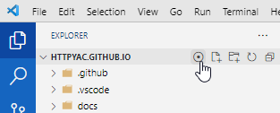

# Reveal Button

Add reveal Button to explorer or editor title menu (showActiveFileInExplorer)

Buttons can be activated in the configuration

## Features
* add reveal button to explorer title menu
* add reveal button to editor title menu 
* add reveal in OS button to explorer title menu
* add reveal in OS button to editor title menu 

